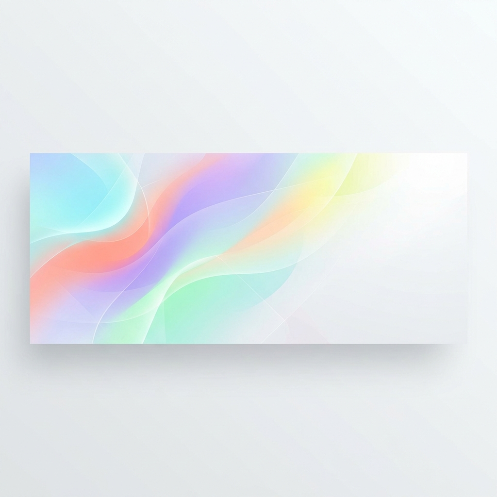

  
    
  
  

 

<h2 align="center">✨ The Visionary & Builder</h2>

  
<b>Bridging the gap between cutting-edge technology and impactful leadership.</b>

  

    🎓 <b>Google Student Ambassador 2026</b>  
    🌟 <b>Co-lead, Google Ed Leadership Program (Pune Division)</b>  
    🚀 <b>Founder of <a href="#">Prepneers</a> (Ed-Tech Platform)</b>
  

 

<h2 align="center">🎨 Technical Arsenal</h2>

  <!-- Languages -->
  
  
  
    
  <!-- Concepts / Domains -->
  
  
  
    
  <!-- Product -->
  

 

<h2 align="center">📱 Featured Mobile Experiences</h2>

  <table width="100%" style="border-collapse: collapse; border: none;">
    <tr style="border: none;">
      <!-- App 1: Resize Anything -->
      <td align="center" width="33%" style="padding: 10px; border: none;">
        
         
        <strong style="font-size: 18px;">Resize Anything</strong>
        

          Multi-format image & document compression engine.
        

        

          
          
        

        
      </td>

      <!-- App 2: Neo-Archery -->
      <td align="center" width="33%" style="padding: 10px; border: none;">
        
         
        <strong style="font-size: 18px;">Neo-Archery</strong>
        

          Fast-paced physics-based archery with procedural levels.
        

        

          
          
        

        
      </td>

      <!-- App 3: YouTube Downloader -->
      <td align="center" width="33%" style="padding: 10px; border: none;">
        
         
        <strong style="font-size: 18px;">Media Downloader</strong>
        

          Frictionless high-quality audio and video extraction.
        

        

          
          
        

        
      </td>
    </tr>
  </table>

 
<h2 align="center">🏆 GitHub Achievements</h2>

  

 

<h2 align="center">📊 Analytics & Activity</h2>

  
  

 

    

 

<h2 align="center">🐍 Contribution Graph Activity</h2>

  <picture>
    <source media="(prefers-color-scheme: dark)" srcset="https://raw.githubusercontent.com/ddurgeshmahajan/ddurgeshmahajan/output/github-contribution-grid-snake-dark.svg">
    <source media="(prefers-color-scheme: light)" srcset="https://raw.githubusercontent.com/ddurgeshmahajan/ddurgeshmahajan/output/github-contribution-grid-snake.svg">
    
  </picture>

 

  <i>"Code is poetry, but building products is an art."</i>

